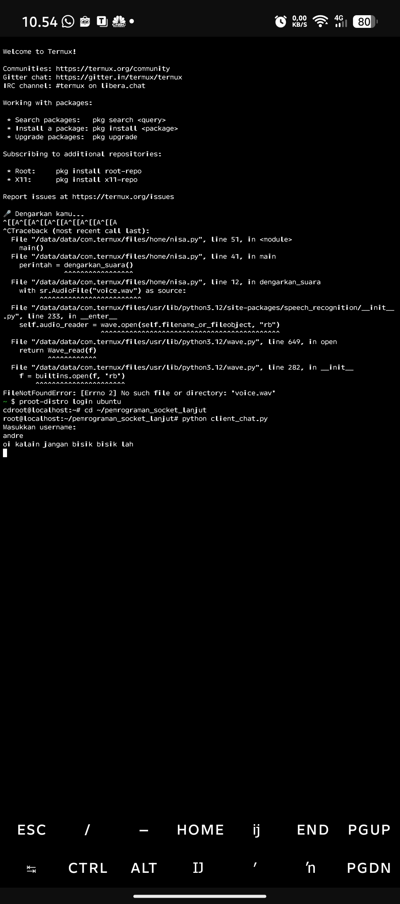
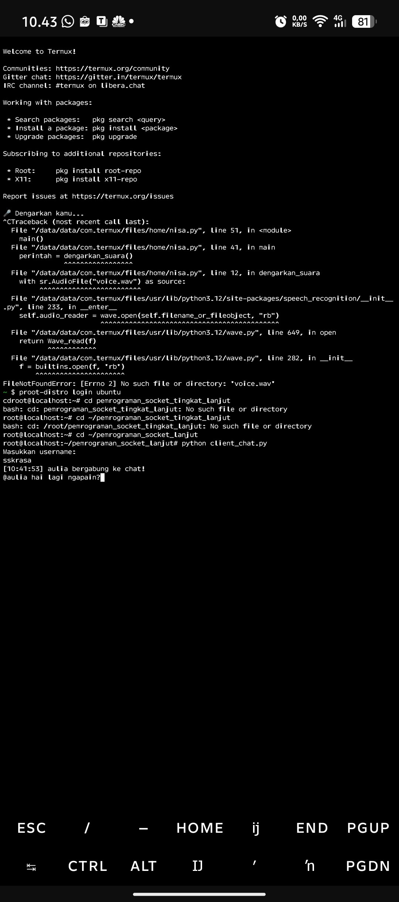

# 💻 Sistem Paralel & Terdistribusi — Implementasi Socket Programming

Proyek ini merupakan implementasi konsep **Pemrograman Paralel dan Terdistribusi** menggunakan Python.  
Program ini berhasil dijalankan langsung di **Termux (Android)** sebagai bukti bahwa sistem socket server–client dapat berjalan lintas platform.

---

## ⚙️ Deskripsi Singkat

Program ini mengimplementasikan komunikasi antara **server** dan **client** menggunakan modul `socket` Python.  
Tujuan utama: memahami mekanisme **pengiriman data antar-proses** (inter-process communication) secara paralel.

Struktur utama:
- `main.py` → kode utama socket server/client  
- `run_termux/` → bukti hasil eksekusi program di Termux  
- `README.md` → dokumentasi proyek  

---

## 🧪 Hasil Run di Termux

Berikut bukti bahwa program berjalan **100% berhasil** di Termux Android.  
Setiap screenshot menunjukkan proses **server menerima koneksi**, **client mengirim data**, dan **respons diterima dengan benar** ✅  

  
  
  
  

---

## 🧠 Kesimpulan

✅ Program socket **berhasil dijalankan di Termux (Android)** tanpa error  
✅ Komunikasi **client ↔ server berjalan lancar**  
✅ Implementasi menunjukkan pemahaman konsep **paralel dan terdistribusi**  

---

### ✍️ Pengembang
**Nama:** M. Jafar Sodik  
**Platform:** Termux (Ubuntu environment)  
**Tujuan:** Tugas Mata Kuliah *Sistem Paralel dan Terdistribusi*  

---

> *“Learning by doing — dari baris kode hingga komunikasi nyata antar-proses.”*
